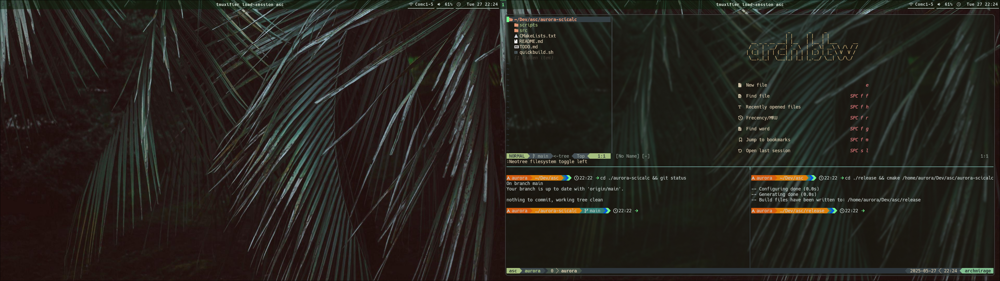

# Jungle
Green themed config for arch with hyprland.

## Packages:
tmux
neovim
zshell
git
kitty
hyprland
wofi
zen/firefox
hyprshot
swaync
libnotify
hyprlock
hyprpaper
starship

- System theming is modified version of AlienBlood provided by https://github.com/dexpota/kitty-themes.git by Dexpota, MIT License Copyright (c) 2019 Fabrizio Destro fabrizio@destro.dev
- This config borrows some source code from TypecraftDev, https://github.com/typecraft-dev/dotfiles as well as his online tutorials. Thank you to him.
- Starship theming is inspired from starship.rs - Tokyo Night Preset - using AlienBlood coloring.

## Git Commands
Tmux:
git clone https://github.com/tmux-plugins/tpm ~/.tmux/plugins/tpm

Tmuxifier:
git clone https://github.com/jimeh/tmuxifier.git ~/.tmuxifier

Kitty:
git clone --depth 1 https://github.com/dexpota/kitty-themes.git ~/.config/kitty/kitty-themes
or
THEME=https://raw.githubusercontent.com/dexpota/kitty-themes/master/themes/<theme_name>.conf
wget "$THEME" -P ~/.config/kitty/kitty-themes/themes

Zshell:
if .zshrc or .bashrc
export PATH="$HOME/.tmuxifier/bin:$PATH"

Ohmyzsh:
sh -c "$(curl -fsSL https://raw.githubusercontent.com/ohmyzsh/ohmyzsh/master/tools/install.sh)"
git clone https://github.com/jeffreytse/zsh-vi-mode \
  $ZSH_CUSTOM/plugins/zsh-vi-mode
git clone https://github.com/zsh-users/zsh-autosuggestions ${ZSH_CUSTOM:-~/.oh-my-zsh/custom}/plugins/zsh-autosuggestions
